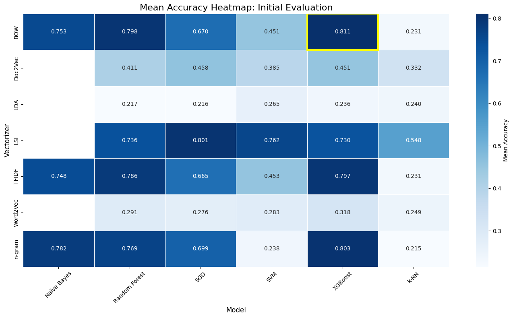

#   Multi‑class text classifier

This repository contains a single Jupyter notebook (**`Text Classification.ipynb`**) that builds a **multi‑class text classifier** over five semantically related research topics. The notebook documents the full workflow—from corpus preparation to model evaluation and error analysis—while emphasizing **what was done** and **what was learned** (installation kept minimal).

---

## What this notebook does

- **Corpus design (5 interrelated topics).**  
  Each category is sampled to **200 documents abstract**; each document yields a ~**100‑word** record. Records are **labeled** (e.g., A–E) by the category they belong to.
- **Unbiased splits.** Creates **training / validation / test** partitions using **stratified random sampling**, holding out data for honest final evaluation.
- **Text preprocessing.** Lowercasing, punctuation/URL cleanup, optional lemmatization/tokenization, and **stop‑word removal**.
- **Feature transformations.** Bag‑of‑Words, **TF‑IDF**, configurable **n‑grams**; optional **topic models (LDA)** or **simple embeddings** (sentence/word averages).
- **Model training.** Classical baselines: **Logistic Regression (LR)**, **Linear SVM**, **Multinomial Naive Bayes (NB)**, **Random Forest (RF)**. Pipelines with grid/random search where relevant.
- **Evaluation protocol.** **10‑fold cross‑validation** on training data (or train+val) to tune hyperparameters; final metrics reported on an **unseen test set**.
- **Bias/variance diagnostics.** Compare algorithms, inspect **bias vs. variance** behavior, choose a **champion model**.
- **Stress tests & robustness.** Deliberately **make prediction harder** (reduce per‑record words, perturb features, or alter metadata overlays) to degrade accuracy by ~**20%** and re‑evaluate bias/variance.  
  Overlays considered include **genre/PICO facets** (population, intervention, comparisons, outcome), **publication year**, and **nationality**, to surface domain‑shift sensitivity.
- **Error analysis.** Identify misclassified records, characterize **confusions** between categories, and propose **semantic explanations** (e.g., shared terminology, overlapping methods).
- **Visualization & reporting.** Plots for **class distribution**, **confusion matrices**, **ROC/PR curves** (for one‑vs‑rest), and score trajectories under stress tests.


---

## Methods at a glance

- **Preprocessing:** cleanup → tokenization/lemmatization (optional) → stop‑words removal.  
- **Features:** BoW & **TF‑IDF** with n‑gram control; optional **LDA** topics or averaged **embeddings**.  
- **Models:** LR / Linear‑SVM / NB / RF (with regularization and class weights where applicable).  
- **Validation:** **10‑fold CV**, stratified splits, fixed random seeds for reproducibility.  
- **Metrics:** accuracy, **macro/micro/weighted F1**, precision/recall; **confusion matrices**; **ROC/PR** (one‑vs‑rest).


---

## Data notes

- Place source texts under `Abstract/` (or update the path at the top of the notebook). 
- Each category is **sampled to 200 docs abstract**; each doc produces a **~100‑word** record for comparability.  
- The notebook logs class counts after sampling and after splitting to confirm balance.

---

## Results snapshot

  

---

## Robustness & bias/variance experiments

- **Reduce information:** shorten records (e.g., from ~100 words → ~60–80 words) to target a **~20% accuracy drop**, then re‑measure F1 and variance.  
- **Overlay facets:** stratify or slice results by **PICO facets**, **publication year**, **nationality**, etc., to reveal domain shifts.  


---

## Repository layout (suggested)

```
.
├── Text Classification.ipynb     # main notebook
├── Abstract/                         # raw/processed texts
├── images/                       # exported figures (confusion matrix, ROC/PR, etc.)
└── README.md
```

---
